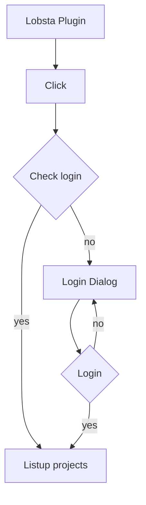

# Lobsta QGIS Plugin

This is a QGIS plugin supports the Lobsta project or Redmine GTT project.

## How to develop

```bash
uv venv --python /Applications/QGIS.app/Contents/MacOS/bin/python3
uv pip compile pyproject.toml
```

## Static type checking

```bash
uv run mypy --explicit-package-bases .
```

## Development documentation

### Login Diagram


